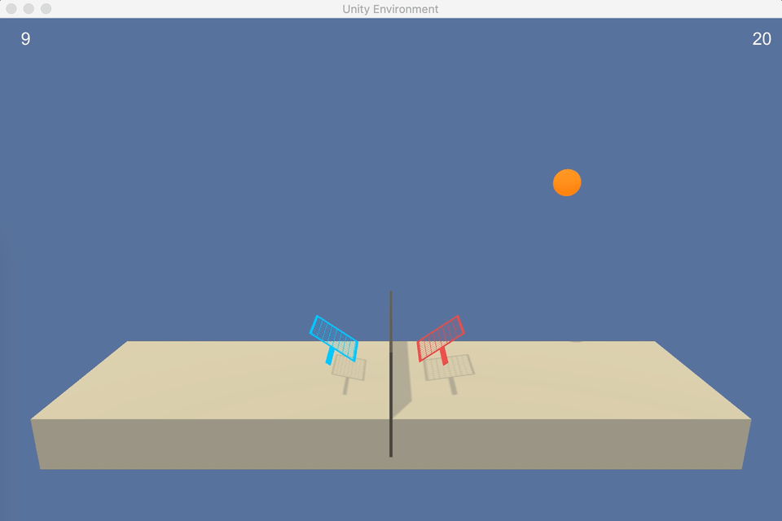
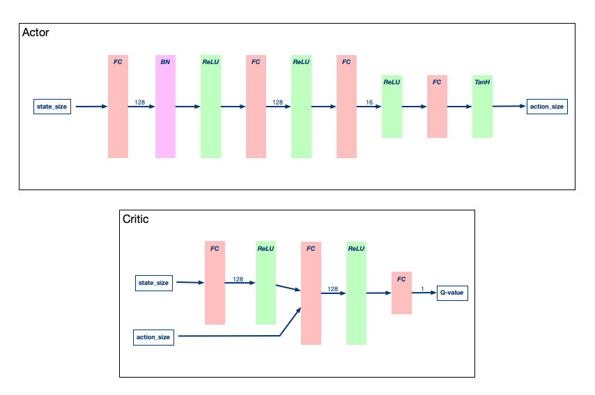
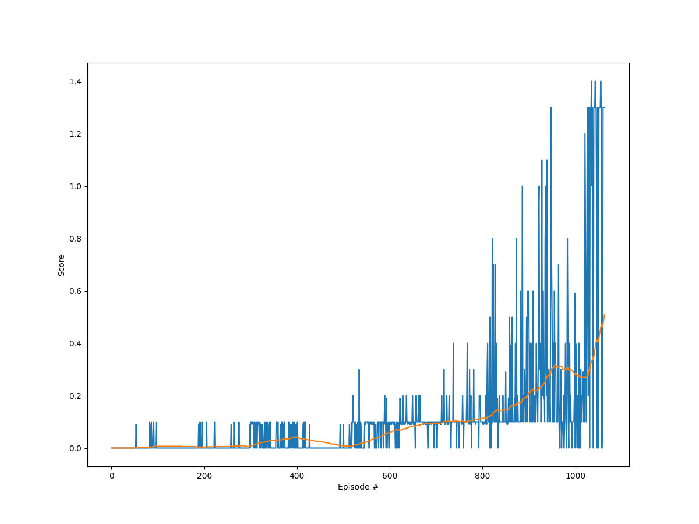
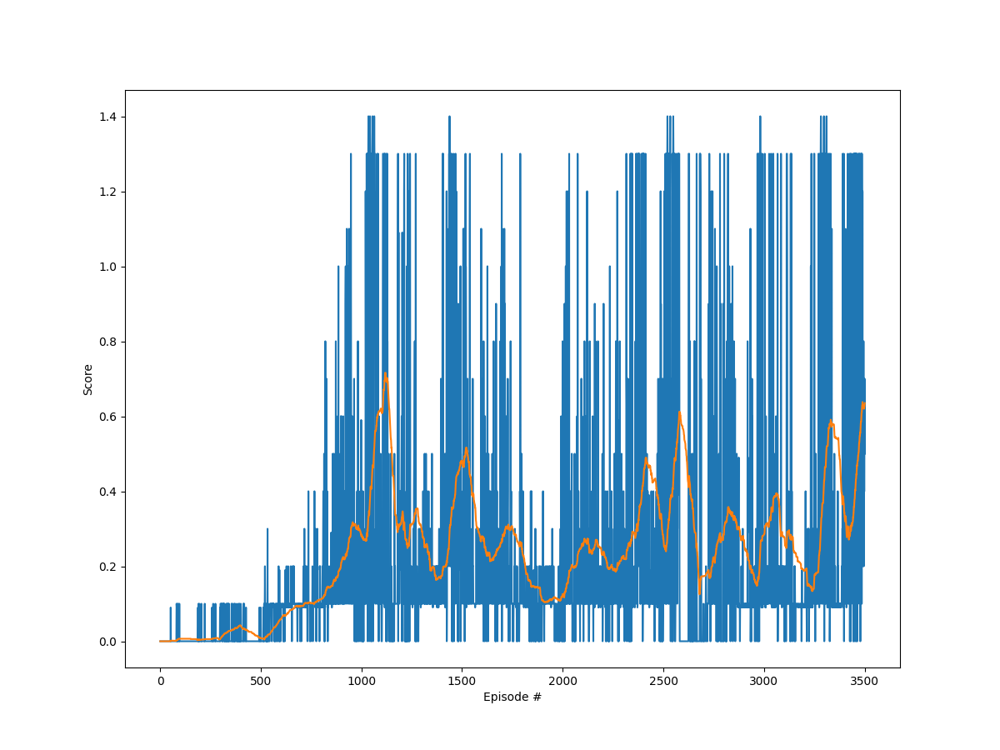

# Project 3: Collaboration and Competition

In this project I have implemented the **DDPG Algorithm**. 
We show how this algorithm can solve a different environment that the one that we had in previous projects, without changing almost nothing.

The environment we try to solve is the Tennis from Unity (read the [README.md](README.md) for the description of the environment)


*Tennis Environment with random actions*

What we can see is that the rackets don't know what to do.


### Learning Algorithm

The solution follows the one found in the [paper](https://arxiv.org/abs/1509.02971), although we have made some changes in hyperparameters and network architecture. We changed only the $\gamma$ from the previous project 
- Hyperparameters  
$\text{Buffer size} = 10^5 \, ; \quad \text{Batch size} = 256$  
$\gamma = 0.99 $  
$\tau = 10^{-3}$  
$\text{lr actor} = 10^{-3} \, ; \quad \text{lr critic} = 10^{-3}$  
$\text{weight decay} = 0$  
$\sigma = 0.2 \qquad  \text{For the Ornstein-Uhlenbeck process} $

- Network Architecture for the DDPG networks: 
    We implement 4 networks: 2 for the critic and 2 for the actor. They are slightly different from each other. 
    

*DDPG Network Architecture*

### DDPG (Deep Deterministic Policy Gradient)

We implement the algorithm like in class and the original paper. 

\begin{align}
&\mathbf{\text{Algorithm 1: DDPG algorithm }}\\
&\hline\\
&\text{Randomly initialize critic network $Q(s,a|\theta^Q)$ and actor $\mu(s|\theta^\mu)$ with weights $\theta^Q$ and $\theta^\mu$.}\\
& \text{Initialize target network $Q'$ and $\mu'$ with weights $\theta^{Q'} \leftarrow \theta^Q, \theta^{\mu'} \leftarrow \theta^\mu$ .}\\
&\text{Initialize replay buffer $R$}\\
&\mathbf{ \text{for}} \text{ episode = 1,M } \mathbf{\text{do}} \\
&\quad \text{Initialize a random process $\mathcal{N}$ for action exploration}\\
&\quad \text{Receive initial observation state $s_1$}\\
&\quad \mathbf{\text{for}} \text{ t=1,T } \mathbf{\text{do}}\\
&\quad \quad \text{Select action $a_t = \mu (s_t|\theta^\mu) + \mathcal{N}_t$ acording to the current policy and exploration noise}\\
&\quad \quad \text{Execute action $a_t$ and observe reward $r_t$ and observe new state $s_{t+1}$}\\
&\quad \quad \text{Store transition $(s_t,a_t,r_t,s_{t+1})$ in $R$} \\
&\quad \quad \text{Sample a random minibatch of $N$ transitions $(s_t,a_t,r_t,s_{t+1})$ from $R$}\\
&\quad \quad \text{Set $y_i = r_i + \gamma Q'(s_{i+1},\mu'(s_{i+1}|\theta^{\mu'})|\theta^{Q'})$} \\
&\quad \quad \text{Update critic by minimizing the loss: $L = \frac{1}{N} \sum_{i} \big(y_i - Q(s_i,a_i|\theta^Q)\big)^2$} \\
&\quad \quad \text{Update the actor policy using the sampled policy gradient: } \\
&\quad \quad \quad \nabla_{\theta^\mu}J \approx \frac{1}{N} \sum_i \nabla_a Q(s,a\|\theta^Q) \big|_ {s=s_i, a = \mu(s_i)}\nabla_{\theta^\mu} \mu(s|\theta^\mu)|_ {s_i} \\
&\quad \quad \text{Update the target network: } \\
&\quad \quad \quad \theta^{Q'} \leftarrow \tau \theta^Q + (1-\tau) \theta^{Q'}\\
&\quad \quad \quad \theta^{\mu'} \leftarrow \tau \theta^\mu + (1-\tau) \theta^{\mu'} \\
&\quad \mathbf{ \text{end for}}\\
&\mathbf{ \text{end for}}\\
\end{align}

So, in the `Agent` class in [`ddpg_agent.py`](./ddpg_agent.py) we initialize the critic, $Q$, and actor, $\mu$, networks, and their targets, $Q'$ and $\mu'$, and the replay buffer. 

```python
class Agent():
    
    def __init__(self, state_size, action_size, random_seed):
                
        self.state_size = state_size
        self.action_size = action_size
        self.seed = random.seed(random_seed)

        # Actor Network (w/ Target Network)
        self.actor_local = Actor(state_size, action_size, random_seed).to(device)
        self.actor_target = Actor(state_size, action_size, random_seed).to(device)
        self.actor_optimizer = optim.Adam(self.actor_local.parameters(), lr=LR_ACTOR)

        # Critic Network (w/ Target Network)
        self.critic_local = Critic(state_size, action_size, random_seed).to(device)
        self.critic_target = Critic(state_size, action_size, random_seed).to(device)
        self.critic_optimizer = optim.Adam(self.critic_local.parameters(), lr=LR_CRITIC, weight_decay=WEIGHT_DECAY)

        # Noise process
        self.noise = OUNoise(action_size, random_seed, sigma=SIGMA) #he afegit el sigma

        # Replay memory
        self.memory = ReplayBuffer(action_size, BUFFER_SIZE, BATCH_SIZE, random_seed)
        # learn every x steps
        self.num_steps = 0
```


>*Change from previous project*: We made one little change in the `step()` method to save all the experiences received (we just add a loop)
```python
    def step(self, state, action, reward, next_state, done):
        """Save experience in replay memory, and use random sample from buffer to learn."""
        # Save experience / reward
        for i in range(len(state)):
            self.memory.add(state[i], action[1], reward[i], next_state[i], done[i])
        self.num_steps +=1

```


We execute the episode loop and main loop in the `train_agent.py` or in the notebook
```python
    for i_episode in range(1, n_episodes+1):
        env_info = env.reset(train_mode=train_mode)[brain_name]
        num_agents = len(env_info.agents)
        score = 0
        states = env_info.vector_observations
        for t in range(max_t):
            agent.reset()
            actions = agent.act(states)
            env_info = env.step(actions)[brain_name]
            next_states= env_info.vector_observations
            rewards = env_info.rewards
            dones = env_info.local_done
            agent.step(states, actions, rewards, next_states, dones)
            states = next_states
            score += np.mean(env_info.rewards)
            if np.any(dones):
                break

        ...
```

In the loop we execute the Agent's methods `act` (Returns actions for given state as per current policy) and `step` (Save experience in replay memory, and use random sample from buffer to learn) where we call the `method` to update the value parameters, given a batch of experiences. 

### Results

- Plot of rewards

*Training results of solved environment*

Episode **1063**	Average Score: **0.51**	Score: [1.30000002 1.30000002]  
Environment solved in **1063** episodes!	Average Score: **0.51**

We also try to train for longer time and see if the agent can get a better average score (over 100 episodes). We see that then mean goes up an down, so probably we could do better adjusting the model or the hyperparameters. Anyway, we already solved the environment.


*Long training*


> Note that this results will change from machine and the seed seems the way to make the networks converge


### Playing Agent
Example of the trained agent

*Tennis Environment with trained agent*

## Ideas for future work
- Find a way to make the algorithm more robust to the change of the random seed
- Play with other hyperparameters
- Try other learning algorithms 
